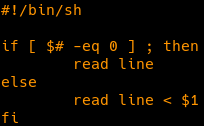

# get_next_line
 
This project is the 2nd of the 42 School cursus.

# Description
In this project, we must write a function that reads from a file descriptor, line by line.
The function must return the line read, without the newline character.
